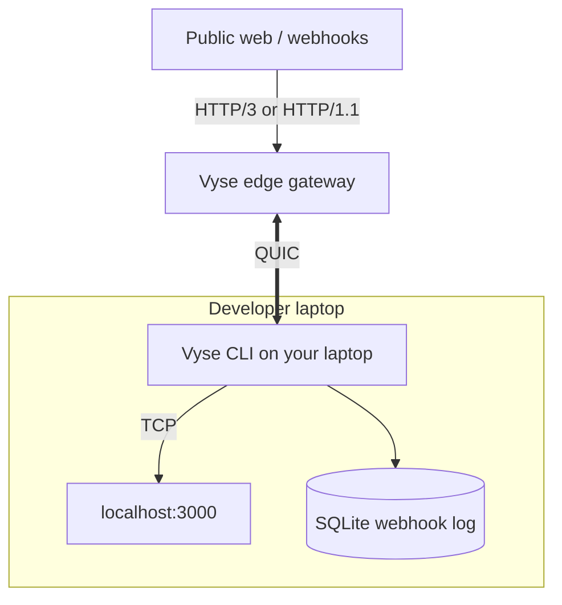

<div align="center">
  <h1>⚡ Vyse</h1>
  <p><strong>A fast, reconnect-proof tunnel for local dev.</strong></p>

  [](LICENSE-MIT)
  [](LICENSE-APACHE)
  [](https://www.rust-lang.org)
  [](https://github.com/meet447/vyse/actions/workflows/ci.yml)
</div>

---

**Vyse** exposes a local HTTP server on a public URL over a QUIC tunnel. The hosted edge speaks **HTTP/3** (with HTTP/1.1 fallback for webhook senders). Your laptop stays connected over **QUIC**, so a Wi-Fi → cellular switch keeps the same session. Incoming webhooks are logged locally so you can inspect and replay them — no third-party dashboard.

See [Product.md](Product.md) for the full product spec and roadmap.

## Install

**macOS / Linux (recommended):**

```bash
curl -fsSL https://raw.githubusercontent.com/meet447/vyse/main/install.sh | bash
```

Add the install directory to your shell `PATH` if the script tells you to (default: `~/.vyse/bin`).

**Manual download:** pick your platform from [GitHub Releases](https://github.com/meet447/vyse/releases/latest) and put the `vyse` binary on your `PATH`.

## Quickstart

Start your local app (any port):

```bash
python3 -m http.server 3000
```

In another terminal, claim a public URL and forward traffic to it:

```bash
vyse serve 3000
```

On first run, Vyse asks for a subdomain (for example `my-app`). That choice is saved locally — the next `vyse serve` reuses it.

Your persistent public URL:

```text
https://my-app.vyse.chipling.xyz
```

Press **Ctrl+C** to stop the tunnel.

## Webhook replay

While a tunnel is live, Vyse shows a terminal UI with the last 500 captured requests. Replay any of them:

```bash
vyse replay <id>
```

## Advanced

**Multi-port routing** — one URL, several local services:

```bash
vyse serve 3000 --route "/api=8000" --route "/=3000"
```

**Run the edge locally** (for contributors):

```bash
cargo run -p vyse-edge
```

Then point the CLI at your local edge:

```bash
vyse tunnel --edge 127.0.0.1:4433 --port 3000 --subdomain my-app
```

(`tunnel` is a hidden alias; `serve` is the supported command for the hosted edge.)

## Architecture



## Contributing

Vyse is in active development. See [Product.md](Product.md) for what ships in v1 vs later add-ons (Wasm middleware, eBPF, MASQUE datagrams).

To hack on the repo:

```bash
git clone https://github.com/meet447/vyse
cd vyse
cargo test --workspace
```

## Releasing

Tag a version to build binaries for Linux, macOS (Intel + Apple Silicon), and Windows, then publish a GitHub Release:

```bash
git tag v0.1.0
git push --tags
```

The [release workflow](.github/workflows/release.yml) uploads `vyse-<target>.tar.gz` / `.zip` artifacts and a `SHA256SUMS` file.

## License

Vyse is dual-licensed under the [MIT License](LICENSE-MIT) and [Apache License 2.0](LICENSE-APACHE).
