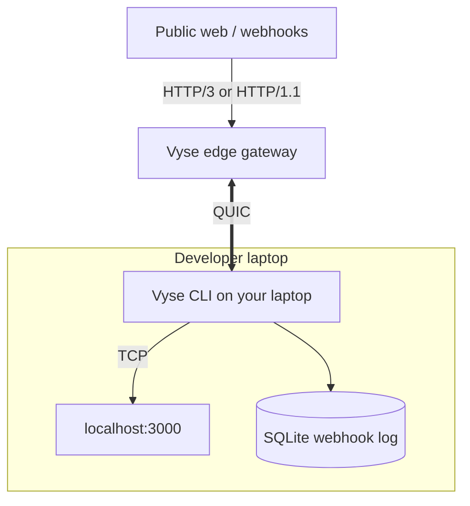

<div align="center">
  <h1>⚡ Vyse</h1>
  <p><strong>A fast, reconnect-proof tunnel for local dev.</strong></p>

  [](LICENSE-MIT)
  [](LICENSE-APACHE)
  [](https://www.rust-lang.org)
  [](https://github.com/meet447/vyse/actions/workflows/ci.yml)
</div>

---

**Vyse** exposes a local HTTP server on a public URL over a QUIC tunnel. The edge speaks **HTTP/3** (with HTTP/1.1 fallback for webhook senders). Your laptop stays connected over **QUIC**, so a Wi-Fi → cellular switch keeps the same session. Incoming webhooks are logged locally so you can inspect and replay them — no third-party dashboard.

This repository is **open source** (dual-licensed MIT OR Apache-2.0) and also powers the **hosted** edge at `vyse.chipling.xyz`. The default CLI talks to production out of the box; you can self-host your own edge from the same code.

See [Product.md](Product.md) for the full product spec and roadmap.

## Hosted (production)

Install the CLI (macOS / Linux):

```bash
curl -fsSL https://raw.githubusercontent.com/meet447/vyse/main/install.sh | bash
```

Add the install directory to your shell `PATH` if the script tells you to (default: `~/.vyse/bin`).

Start your local app, then claim a public URL:

```bash
python3 -m http.server 3000   # in one terminal
vyse serve 3000               # in another
```

On **first run**, Vyse prompts for a subdomain (for example `my-app`). That name is reserved for your machine and saved locally — later `vyse serve` calls reuse it:

```text
https://my-app.vyse.chipling.xyz
```

Run **`vyse serve`** again on a **different port** while your reserved tunnel is still active to get a **random ephemeral URL** for that session.

**Webhook replay** — while a tunnel is live, the terminal UI shows captured requests. Replay any of them:

```bash
vyse replay <id>
```

**Update the CLI** — same as other CLIs:

```bash
vyse update          # install latest GitHub release
vyse update --check  # print status only
```

**Multi-port routing** — one URL, several local services:

```bash
vyse serve 3000 --route "/api=8000" --route "/=3000"
```

**UDP over MASQUE** — advertise a local UDP port and reach it with HTTP/3 `CONNECT-UDP` (RFC 9298). Only loopback targets on ports you passed to `--udp` are allowed:

```bash
vyse serve 3000 --udp 5353
```

Template:

```text
https://my-app.vyse.chipling.xyz/.well-known/masque/udp/127.0.0.1/5353/
```

Manual downloads: [GitHub Releases](https://github.com/meet447/vyse/releases/latest).

## Open source / self-host

Fork the repo, run tests, and operate your own edge. Full instructions: **[docs/self-host.md](docs/self-host.md)**.

| Crate | Binary | Role |
| --- | --- | --- |
| [`vyse-core`](crates/vyse-core) | — | Protocol, QUIC helpers, routing |
| [`vyse-edge`](crates/vyse-edge) | `vyse-edge` | Public gateway and tunnel registry |
| [`vyse-cli`](crates/vyse-cli) | `vyse` | Local daemon, webhook log, TUI |

Quick local stack:

```bash
cargo run -p vyse-edge -- --quic 0.0.0.0:4433 --http 127.0.0.1:8080 --http3 127.0.0.1:8443 --domain localhost --public-base http://localhost:8080

vyse serve 3000 --edge 127.0.0.1:4433 --server-name localhost --subdomain my-app
```

Production ops for the hosted service live in a private, gitignored `/deploy/` directory on maintainer machines — not in this tree.

## Architecture



## Contributing

See [CONTRIBUTING.md](CONTRIBUTING.md). In short:

```bash
git clone https://github.com/meet447/vyse
cd vyse
cargo test --workspace
```

Product details: [Product.md](Product.md) · [docs/product.md](docs/product.md)

## Releasing (maintainers)

Tag a version to build binaries for Linux, macOS (Intel + Apple Silicon), and Windows, then publish a GitHub Release:

```bash
git tag v0.1.0
git push --tags
```

The [release workflow](.github/workflows/release.yml) uploads `vyse-<target>.tar.gz` / `.zip` artifacts and a `SHA256SUMS` file.

## License

Vyse is dual-licensed under the [MIT License](LICENSE-MIT) and [Apache License 2.0](LICENSE-APACHE), at your option.
